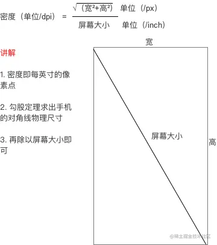

## dpi系数与px数的计算

ldpi QVGA (240×320)——dpi系数0.75——密度值120

mdpi HVGA (320×480)——dpi系数1.0——密度值160

hdpi WVGA (480×800) ——dpi系数1.5——密度值240

xhdpi 720P（1280*720）——dpi系数2.0——密度值320

xxhdpi 1080p（1920*1080 ）——dpi系数3.0——密度值480

## 屏幕适配方案

1. 今日头条适配方式

2. 限定符适配

   1. 单位 *  160(限定符宽度的带下 )/750(设计图大小)    单位px =  xxDP

      屏幕的宽度 (DP)/  设计图宽度 (PX)  计算出的是1px 占用多少DP

3. 鸿洋的百分比适配

### 辅助适配

1. 图片适配
   1. .9图
      .9.png图片本质上还是png图片，相对于普通png图来说，.9图可以让图片在指定的位置拉伸和在指定的位置显示内容且不会失真；

1. xml布局控件适配

   1. 避免写死View的宽高，尽量使用warp_content和match_parent；

   2. 父布局为**LinearLayout**，选择使用**android:layout_weight**属性，为布局中的每个子View设置权重；

   3. 父布局为RelativeLayout，可以选择使用layout_centerInParent等属性，设置子View的相对位置；
				谷歌官方在之前版本中提供了一个百分比布局方式：~~support:percent~~，它支持RelativeLayout和FrameLayout的百分比布局，但是目前官方已经不再维护，而将他取而代之的是新晋布局：**ConstraintLayout**，ConstraintLayout强大之处不仅在于它能够进行百分比布局，还可以进行相对定位、角度定位、尺寸约束、宽高比、Chainl链布局等，在不同设备间都能处理的游刃有余。

2. Android9.0官方适配
	1. 刘海适配
			将内容呈现到刘海区域中，则可以使用 WindowInsets.getDisplayCutout()来检索 DisplayCutout 对象，同时可以使用窗口布局属性 layoutInDisplayCutoutMode控制内容如何呈现在刘海区域中。

[Android 屏幕适配方案](屏幕适配.md)

[参考1](https://juejin.cn/post/7117630529595244558#heading-9) 

